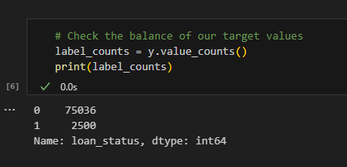
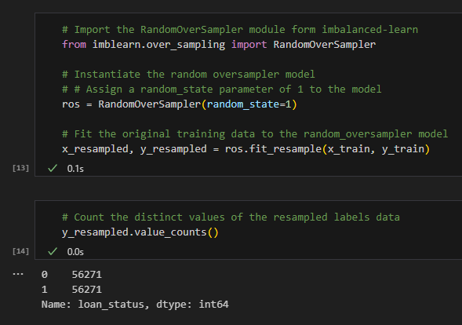

Summary of Classification Analysis

Credit Risk Assessment Using Machine Learning
Financial institutions lend assets or funds to borrowers with the expectation of return or repayment. Credit risk emerges when a borrower defaults on the repayment, leading to financial loss for the lender. To mitigate this, lenders evaluate risk using various methods. In this analysis, we apply Machine Learning techniques to a dataset from a peer-to-peer lending platform, aiming to create a model that predicts the likelihood of borrower default.

For this task, I utilized a machine learning approach to categorize loans as either low-risk or high-risk based on their status as reported by the lending institution.

The dataset from the lending company was scrutinized using a Logistic Regression Model which achieved a high accuracy score of 99%. Nonetheless, the model showed a lower recall for non-healthy loans (0.91) than for healthy loans (0.99), indicating a better prediction rate for healthy loan statuses over non-healthy ones. This imbalance stems from a disproportionate number of healthy loan records in the dataset.

Below is evidence of the dataset's imbalance.

To counteract this and improve the model's precision in classifying non-healthy loans, I employed the RandomOverSampler from the imbalanced-learn library to even out the dataset by augmenting the minority class.

Performance Comparison of Two Machine Learning Models:

Model 1 Performance:
The accuracy, precision, and recall metrics for Model 1 are detailed here. This model, which used the original dataset, showed a higher frequency of healthy loans than non-healthy ones, delivering a 99% accuracy rate. Precision rates were perfect at 100% for healthy loans and commendable at 85% for non-healthy loans. The model also boasted a high recall rate of 99% for healthy loans and 91% for non-healthy loans.

Model 2 Performance:
The second model also featured a 99% accuracy rate. However, it outperformed the first model in predicting false negatives, with only four healthy loans misclassified. Precision for healthy loans remained at 100%, with a slight drop to 84% for non-healthy loans. Importantly, recall rates for non-healthy loans saw improvement.

Conclusive Assessment
The lending company's goal is to accurately separate healthy loans from non-healthy ones to prevent undue expenses. Incorrectly labeling healthy loans as non-healthy could result in the loss of clients, while wrongly classifying non-healthy loans as healthy poses a financial hazard.

The Logistic Regression model, when trained on a balanced dataset, outshone the model using imbalanced data. The rectified dataset notably enhanced both the accuracy and recall, decreasing the misclassification of non-healthy loans.

The company's preference leans towards reducing false positives, where non-healthy loans are incorrectly tagged as healthy. Examining the confusion matrices reveals:

Model 1 (Imbalanced Data):

56 false positives (true: healthy, predicted: non-healthy)
102 false negatives (true: non-healthy, predicted: healthy)
Model 2 (Balanced Data):

4 false positives (true: healthy, predicted: non-healthy)
116 false negatives (true: non-healthy, predicted: healthy)
Given these insights, the balanced data model is preferable for its significant cutback in false positives and heightened proficiency in differentiating healthy from non-healthy loans.